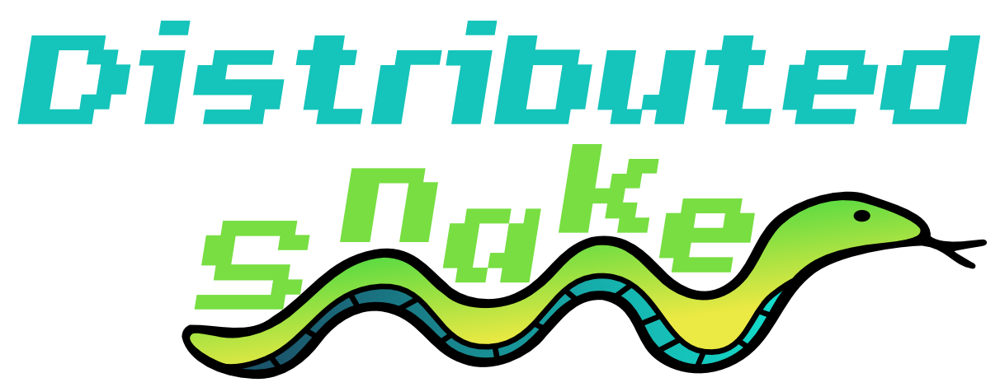

# Distributed Snake

## Running application locally

Make sure the scripts are executable  
`chmod +x <name-of-script>`  

Install all dependencies using the provided install script  
`./01_install.sh`  
Run the application (boot webservers and compile/run other apps)  
`./02_run.sh`

## Domains
### Input (Web app)
A snake gotta snake. So we'll need an application controlling the snakes movement.  
Build a website which captures user input and dispatches it trough its own backend service on a bus. Here we got to capture which snake we are controlling and in which direction we are sending our snake.
### Map (Web app)
All snakes are drawn on a map. Subscribe to the necessary events and use SingalR or something else to draw a map in the frontend.
### Items (Web app)
Manage these items via a web application and distribute the corresponding events on the bus.
### Leaderboard (Web app)
Every snake get associated with a user. The longest snake wins. Subscribe to snake events to determine the winners.
### Users (Web app)
Manage the snakes (users) in the system. 
### Gameloop (Service)
Process snake commands every x seconds and redistribute their locations
### CI/CD/Release (Devopsie)
Setup ci/cd for this repository. Build it?  
Deploy all services somewhere publicly accessible

## Technical
To start things off you could mock all external systems to your domain. As we progress we'll integrate thingies. Contracts are predefined but not binding. If anyone has a better idea consult impacted teams.